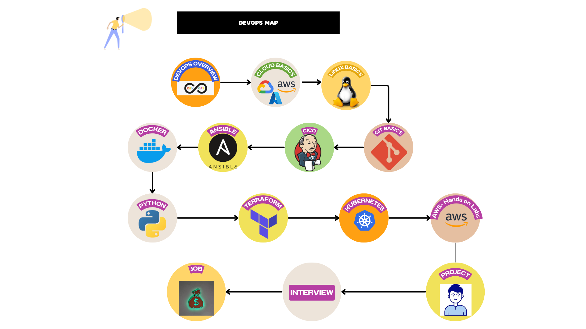

# DevOps Roadmap

Welcome to the **DevOps Roadmap** repository! This guide aims to provide a comprehensive overview of the tools, technologies, and practices necessary to become a proficient DevOps Engineer.

Before you start, it's beneficial to have:

- A basic understanding of programming languages (e.g., Python, Bash)
- Familiarity with Linux/Unix command line
- Basic knowledge of networking and system administration

### How to Use This Roadmap

- Follow the roadmap step-by-step or jump to specific sections based on your current knowledge level and learning goals.
- Explore the resources and tools listed under each section for in-depth understanding.

## Roadmap Sections

### 1. Version Control Systems (VCS)
- **Tools**: Git, GitHub, GitLab
- **Concepts**: Branching, Merging, Pull Requests, Rebase, Conflict Resolution

### 2. Continuous Integration/Continuous Deployment (CI/CD)
- **Tools**: Jenkins, GitHub Actions, GitLab CI, CircleCI
- **Concepts**: CI Pipelines, CD Pipelines, Build Automation, Testing, Deployment Strategies

### 3. Infrastructure as Code (IaC)
- **Tools**: Terraform, AWS CloudFormation, Ansible, Chef, Puppet
- **Concepts**: IaC Principles, Declarative vs Imperative, Configuration Management, Provisioning

### 4. Containerization and Orchestration
- **Tools**: Docker, Kubernetes, OpenShift
- **Concepts**: Containerization, Container Registries, Kubernetes Architecture, Service Discovery, Scaling

### 5. Cloud Providers
- **Providers**: AWS, Azure, Google Cloud Platform (GCP)
- **Concepts**: Core Services, Virtual Machines, Networking, Storage, IAM

### 6. Monitoring and Logging
- **Tools**: Prometheus, Grafana, ELK Stack, Splunk
- **Concepts**: Metrics, Logs, Tracing, Alerting, Dashboarding

### 7. Security and Compliance
- **Tools**: HashiCorp Vault, Trivy, Aqua Security, SonarQube
- **Concepts**: Secure Software Development Lifecycle (SSDLC), Vulnerability Management, Access Control, Compliance

### 8. Automation and Scripting
- **Tools**: Bash, Python, PowerShell
- **Concepts**: Scripting Basics, Task Automation, Automation Frameworks
